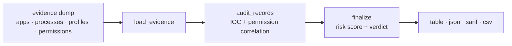

<a name="top"></a>
<div align="center">


# TRACKBLOCK

### Family phone stalkerware audit — MVT-class iOS/Android forensics


[](https://pypi.org/project/cognis-trackblock/) [](https://github.com/cognis-digital/trackblock/actions) [](LICENSE) [](https://github.com/cognis-digital)

*Privacy / Personal — put individuals back in control of their data.*

</div>

```bash
pip install cognis-trackblock
trackblock audit ./evidence_dump      # → verdict + prioritized findings in seconds
```


<!-- cognis:example:start -->
## 🔎 Example output

Real, reproducible output from the tool — runs 100% offline against the bundled
demo evidence (`demos/01-basic/evidence`):

```console
$ trackblock audit demos/01-basic/evidence
TRACKBLOCK audit -- android / Pixel 7 (family-shared)
  artifacts: manifest.json, apps.json, accessibility.json, device_admins.json, permissions.json
  verdict  : SUSPICIOUS  (risk score 100/100)
  findings : 7

  IOC       SEVERITY  FAMILY           DETAIL
  --------- --------- ---------------- ------------------------------
  TB-0007   high      TheTruthSpy      app 'System Service'
  TB-0009   high      KidsGuard        app 'WiFi Helper'
  TB-PERM   high      PermissionCluster 'com.systemservice' holds [...] + accessibility + device-admin
  TB-0015   medium    Sideload         hidden sideloaded app 'System Service' (com.systemservice)
```

```console
$ trackblock audit demos/01-basic/evidence --format json | jq '.verdict, .risk_score, .detection_count'
"suspicious"
100
7
```

> Blocks above are real `trackblock` output — reproduce them from a clone.
> The command exits non-zero when the device is not `clean`, so it doubles as a
> CI / cron gate.

<!-- cognis:example:end -->

## Usage — step by step

1. **Install** the CLI (console script `trackblock`):
   ```bash
   pip install cognis-trackblock
   ```
2. **Audit an evidence directory** — point `audit` at an extracted (offline) phone evidence dump; it scans for stalkerware IOCs and prints a verdict + risk score:
   ```bash
   trackblock audit ./evidence_dump
   ```
3. **Emit JSON** for archival or downstream tooling:
   ```bash
   trackblock audit ./evidence_dump --format json > report.json
   ```
4. **Read the result** — the report carries `verdict` (`clean`/`review`/`suspicious`/`compromised`), `risk_score` (0–100) and a sorted `detections` list; the command exits `0` only when the verdict is `clean` (`1` otherwise, `2` on a bad evidence dir):
   ```bash
   trackblock audit ./evidence_dump --format json | jq '.verdict, .risk_score'
   ```
5. **Automate as a gate** — run it in a scheduled audit and act on the exit code:
   ```bash
   trackblock audit ./evidence_dump || echo "device NOT clean — investigate"
   ```

## Contents

- [Why trackblock?](#why) · [Features](#features) · [Quick start](#quick-start) · [Example](#example) · [Architecture](#architecture) · [AI stack](#ai-stack) · [How it compares](#how-it-compares) · [Integrations](#integrations) · [Install anywhere](#install-anywhere) · [Related](#related) · [Contributing](#contributing)

<a name="why"></a>
## Why trackblock?

Family phone stalkerware audit — MVT-class iOS/Android forensics — without standing up heavyweight infrastructure.

`trackblock` is single-purpose, scriptable, and self-hostable: point it at a target, get prioritized results in the format your workflow already speaks (table · JSON · SARIF), gate CI on it, and let agents drive it over MCP.

<div align="right"><a href="#top">↑ back to top</a></div>

<a name="features"></a>
## Features

- ✅ **Offline forensic audit** — works on an extracted evidence dump, never touches a live device (MVT-class methodology)
- ✅ **Curated indicator database** — 25+ IOCs across documented commercial stalkerware/spyware families (packages, processes, iOS profiles, behaviors)
- ✅ **Permission-cluster correlation** — flags sideloaded/hidden apps holding surveillance permission combos, escalated by accessibility / device-admin empowerment
- ✅ **Risk scoring + verdict ladder** — `clean` → `review` → `suspicious` → `compromised`, with a 0–100 risk score
- ✅ **Four output formats** — human `table`, `json`, **SARIF 2.1.0** (GitHub code-scanning), and `csv`
- ✅ **Tunable exit gate** — `--fail-on` chooses the verdict that fails a pipeline; `--min-severity` filters noise
- ✅ **`list-indicators`** — inspect the built-in IOC database (table/json/csv)
- ✅ **Programmatic API** — `trackblock.core.scan(dir)` returns a plain dict for embedding
- ✅ Runs on Linux/macOS/Windows · Docker · devcontainer
- ✅ Ports in Python, JavaScript, Go, and Rust (`ports/`)

<div align="right"><a href="#top">↑ back to top</a></div>

<a name="quick-start"></a>
## Quick start

```bash
pip install cognis-trackblock
trackblock --version
trackblock audit ./evidence_dump                        # human table
trackblock scan  ./evidence_dump --format json          # 'scan' is an alias of 'audit'
trackblock audit ./evidence_dump --format sarif > out.sarif   # GitHub code-scanning
trackblock audit ./evidence_dump --fail-on compromised  # only fail CI on a confirmed compromise
trackblock list-indicators --platform ios               # inspect the IOC database
```

> `audit` / `scan` take a **directory of extracted evidence** (an offline dump),
> not a live device. See [Usage](docs/USAGE.md) for the evidence layout.

<div align="right"><a href="#top">↑ back to top</a></div>

<a name="example"></a>
## Example

```text
$ trackblock audit demos/01-basic/evidence
TRACKBLOCK audit -- android / Pixel 7 (family-shared)
  verdict  : SUSPICIOUS  (risk score 100/100)
  findings : 7

  IOC       SEVERITY  FAMILY           DETAIL
  TB-0007   high      TheTruthSpy      app 'System Service'
  TB-PERM   high      PermissionCluster 'com.systemservice' holds [...] + accessibility + device-admin
  TB-0015   medium    Sideload         hidden sideloaded app 'System Service'
```

<div align="right"><a href="#top">↑ back to top</a></div>

<a name="architecture"></a>
## Architecture

Evidence artifacts are loaded from an offline dump, correlated against the
curated indicator database and the permission-cluster heuristic, then scored
into a verdict. See [docs/ARCHITECTURE.md](docs/ARCHITECTURE.md) for detail.



<div align="right"><a href="#top">↑ back to top</a></div>

<a name="ai-stack"></a>
## Use it from any AI stack

`trackblock` is interoperable with every popular way of using AI:

- **JSON / SARIF** — pipe `trackblock audit <dir> --format json` (or `sarif`) into any agent, LLM, or code-scanning pipeline
- **Programmatic API** — `from trackblock.core import scan; scan("evidence_dir")` returns a plain dict for tool-wrapping
- **MCP** — an optional MCP server module (`trackblock.mcp_server`, extra `[mcp]`) exposes the same `scan` entry point to agent runtimes
- **CI / scripts** — tunable exit codes (`--fail-on`) + SARIF for non-AI pipelines

<div align="right"><a href="#top">↑ back to top</a></div>

<a name="how-it-compares"></a>
## How it compares

| | **Cognis trackblock** | mvt-project |
|---|:---:|:---:|
| Self-hostable, no account | ✅ | varies |
| Single command, zero config | ✅ | ⚠️ |
| JSON + SARIF for CI | ✅ | varies |
| MCP-native (AI agents) | ✅ | ❌ |
| Polyglot ports (JS/Go/Rust) | ✅ | ❌ |
| Open license | ✅ COCL | varies |

*Built in the spirit of **mvt-project/mvt**, re-framed the Cognis way. Missing a credit? Open a PR.*

<div align="right"><a href="#top">↑ back to top</a></div>

<a name="integrations"></a>
## Integrations

Pipes into your stack: **SARIF** for code-scanning, **JSON** / **CSV** for anything, an optional **MCP server** module (`trackblock.mcp_server`) for AI agents, and a `trackblock-emit` forwarder (STIX/MISP/Sigma/SIEM/Slack/Discord via `cognis-connect`). See [`docs/INTEGRATIONS.md`](docs/INTEGRATIONS.md).

<div align="right"><a href="#top">↑ back to top</a></div>

<a name="install-anywhere"></a>
## Install — every way, every platform

```bash
pip install "git+https://github.com/cognis-digital/trackblock.git"    # pip (works today)
pipx install "git+https://github.com/cognis-digital/trackblock.git"   # isolated CLI
uv tool install "git+https://github.com/cognis-digital/trackblock.git" # uv
pip install cognis-trackblock                                          # PyPI (when published)
docker run --rm ghcr.io/cognis-digital/trackblock:latest --help        # Docker
brew install cognis-digital/tap/trackblock                             # Homebrew tap
curl -fsSL https://raw.githubusercontent.com/cognis-digital/trackblock/main/install.sh | sh
```

| Linux | macOS | Windows | Docker | Cloud |
|---|---|---|---|---|
| `scripts/setup-linux.sh` | `scripts/setup-macos.sh` | `scripts/setup-windows.ps1` | `docker run ghcr.io/cognis-digital/trackblock` | [DEPLOY.md](docs/DEPLOY.md) (AWS/Azure/GCP/k8s) |

<div align="right"><a href="#top">↑ back to top</a></div>

<a name="related"></a>
## Related Cognis tools

- [`recall`](https://github.com/cognis-digital/recall) — Privacy-first local RAG over personal data — encrypted, audit-logged
- [`optout`](https://github.com/cognis-digital/optout) — Automated data-broker opt-out engine — top 50 brokers, CCPA/GDPR letters
- [`vaultmap`](https://github.com/cognis-digital/vaultmap) — Personal asset & account inventory — estate-planning-grade encrypted
- [`breachwatch`](https://github.com/cognis-digital/breachwatch) — Personal breach aggregator — HIBP + DeHashed + stealer-log triage
- [`piicomb`](https://github.com/cognis-digital/piicomb) — Local PII discovery in your own files — SSN/CC/passport/DL/email/phone/DOB
- [`privacyshell`](https://github.com/cognis-digital/privacyshell) — Hardened browser profile generator — Firefox / LibreWolf / Brave

**Explore the suite →** [🗂️ all 170+ tools](https://github.com/cognis-digital/cognis-neural-suite) · [⭐ awesome-cognis](https://github.com/cognis-digital/awesome-cognis) · [🔗 cognis-sources](https://github.com/cognis-digital/cognis-sources) · [🤖 uncensored-fleet](https://github.com/cognis-digital/uncensored-fleet) · [🧠 engram](https://github.com/cognis-digital/engram)

<div align="right"><a href="#top">↑ back to top</a></div>

<a name="configuration"></a>
## Configuration reference

`trackblock` is configured entirely through CLI flags — no config files, no
environment variables required.

| Flag | Applies to | Values | Default | Effect |
|---|---|---|---|---|
| `--format` | all commands | `table`, `json`, `sarif`, `csv` | `table` | Output rendering. `sarif` emits SARIF 2.1.0 for code-scanning. |
| `--min-severity` | `audit` / `scan` | `critical`, `high`, `medium`, `low`, `info` | *(keep all)* | Drop detections below this severity, then **re-score** the report. |
| `--fail-on` | `audit` / `scan` | `clean`, `review`, `suspicious`, `compromised`, `never` | `review` | Lowest verdict that yields a non-zero exit. `review` reproduces the legacy "non-zero unless clean" behavior; `never` always exits 0. |
| `--platform` | `list-indicators` | `any`, `ios`, `android` | `any` | Filter the indicator database. |

**Exit codes:** `0` = verdict below the `--fail-on` threshold (pass) · `1` =
verdict at/above threshold (findings) · `2` = evidence directory missing or an
artifact was malformed.

<a name="faq"></a>
## FAQ

**Does trackblock touch my phone directly?** No. It audits an *offline evidence
dump* — JSON artifacts you extract from the device first — so the analysis is
reproducible and never risks the live device.

**What evidence does it read?** Any subset of `manifest.json`, `apps.json`,
`processes.json`, `profiles.json` (iOS), `accessibility.json`,
`device_admins.json`, `permissions.json`. Missing files are skipped; a malformed
file is a hard error. See [docs/USAGE.md](docs/USAGE.md).

**Will it catch spyware that isn't in the database?** The named-IOC set catches
documented families; the **permission-cluster** heuristic catches *unnamed*
apps that behave like surveillanceware (hidden/sideloaded + surveillance
permissions + accessibility/device-admin). Contributions of new IOCs are welcome.

**Can I gate CI on it?** Yes — use the exit code, and tune `--fail-on` to your
tolerance. `--format sarif` uploads straight into GitHub code-scanning.

**Is a match proof of stalkerware?** No. Treat findings as leads for a human
reviewer. Some MDM profiles are legitimate (see the `demos/` scenarios).

<a name="contributing"></a>
## Contributing

PRs, new rules, and demo scenarios are welcome under the collaboration-pull model — see [CONTRIBUTING.md](CONTRIBUTING.md) and [SECURITY.md](SECURITY.md).

> ### ⭐ If `trackblock` saved you time, **star it** — it genuinely helps others find it.

## Interoperability

`{}` composes with the 300+ tool Cognis suite — JSON in/out and a shared
OpenAI-compatible `/v1` backbone. See **[INTEROP.md](INTEROP.md)** for the
suite map, composition patterns, and reference stacks.

## License

Source-available under the **Cognis Open Collaboration License (COCL) v1.0** — free for personal, internal-evaluation, research, and educational use; **commercial / production use requires a license** (licensing@cognis.digital). See [LICENSE](LICENSE).

---

<div align="center"><sub><b><a href="https://cognis.digital">Cognis Digital</a></b> · one of 170+ tools in the <a href="https://github.com/cognis-digital/cognis-neural-suite">Cognis Neural Suite</a> · <i>Making Tomorrow Better Today</i></sub></div>
